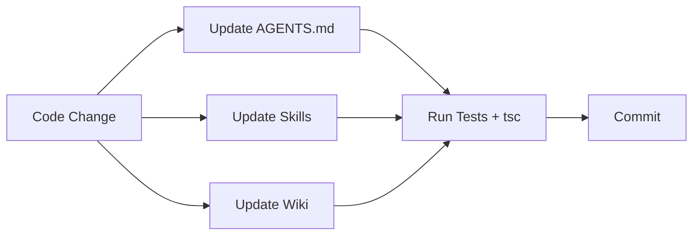

# Skill: Auto-Update — Gmind

Автоматическое обновление roadmap, skills, docs и wiki после каждого изменения кода.

## Pipeline обновления

После каждого изменения в коде (новый feature, API endpoint, компонент, тест):



## Шаг 1: AGENTS.md — Roadmap

### Разделы для обновления:

| Раздел | Где | Что делать |
|---|---|---|
| `Последние фичи` | ~строка 108-150 | Добавить строку `- [x] **Feature name** — описание` в начало списка |
| `Векторы развития` | ~строка 300+ | Переместить реализованные `[x]` из соответствующей V-секции, добавить новые `[ ]` при необходимости |
| `Баги` | ~строка 150+ | Добавить исправленный баг в список с форматом: `N. Bug: причина → фикс` |
| `Статус` | ~строка 30-50 | Добавить новый стек/технологию в таблицу |

### Правила форматирования:

```markdown
- [x] **Feature name** - краткое описание, ключевые файлы: `path/file.ts:line`
- [ ] **Planned feature** - описание
```

Для багов:
```markdown
N. Component: проблема → решение
```

## Шаг 2: Skills — синхронизация

### Когда обновлять skills:

- **Новый API endpoint** → `skills/api-typing.md` (добавить в таблицу эндпоинтов)
- **Новый компонент** → создать skill или дополнить `skills/ui-system.md`
- **Новые тесты** → `skills/tests.md` (обновить таблицу + статистику)
- **Новый Docker/CI** → `skills/docker.md`
- **Новая фича экспорта** → `skills/export-import.md`
- **Новая фича PWA** → `skills/pwa-share-target.md`
- **Новая коллаборация** → `skills/collaboration.md`

### Структура skill-файла:

```markdown
# Skill: <Name> — Gmind

## Быстрый старт

\`\`\`bash
# команды
\`\`\`

## Implementation

### Key Files

| Файл | Назначение |
|---|---|

### API / Types

### Testing

## Related
```

## Шаг 3: Wiki — документация

### Когда обновлять wiki:

| Wiki файл | Триггер | Действие |
|---|---|---|
| `01-architecture.md` | Новая директория, новый модуль, новый компонент | Добавить описание архитектуры |
| `02-api-reference.md` | Новый REST endpoint, новый WS message | Добавить таблицу эндпоинтов |
| `03-websocket.md` | Новый WS message type, новый протокол | Добавить сообщение + пример |
| `05-layout-engine.md` | Новый layout алгоритм, новый параметр | Добавить алгоритм, параметры |
| `07-improvements.md` | Реализован improvement | Чекбокс `[x]` |
| `09-layout-directions.md` | Новое направление layout | Добавить spec |
| `10-privacy-sharing.md` | Изменение в коллаборации | Обновить API таблицу |

### Процедура:

1. **Проверить** — `grep -rn "TODO\|FIXME\|HACK\|XXX" frontend/src/ backend/` — найти незадокументированные места
2. **Сравнить** — свежие изменения в git diff с тем, что уже описано в wiki
3. **Обновить** — добавить недостающие разделы, исправить устаревшие
4. **index.md** — добавить ссылку на новый wiki файл

## Шаг 4: Валидация

После всех обновлений запустить:

```bash
# Backend
cd backend && go build ./... && go test ./...

# Frontend
cd frontend && npx tsc --noEmit && npx vitest run

# Валидация AGENTS.md
grep -c "^-[ \]\[x\]" AGENTS.md   # количество выполненных фич
grep -c "^-[ \]\[ \]" AGENTS.md   # количество запланированных фич
```

## Автоматизация (будущее)

Планируется bash-скрипт `scripts/auto-update.sh`, который:
1. Читает `git diff HEAD` для списка изменений
2. Сканирует новые экспорты/функции/типы через `grep`
3. Обновляет AGENTS.md: adds new feature line
4. Пингует agent о необходимости перепроверить skills и wiki
